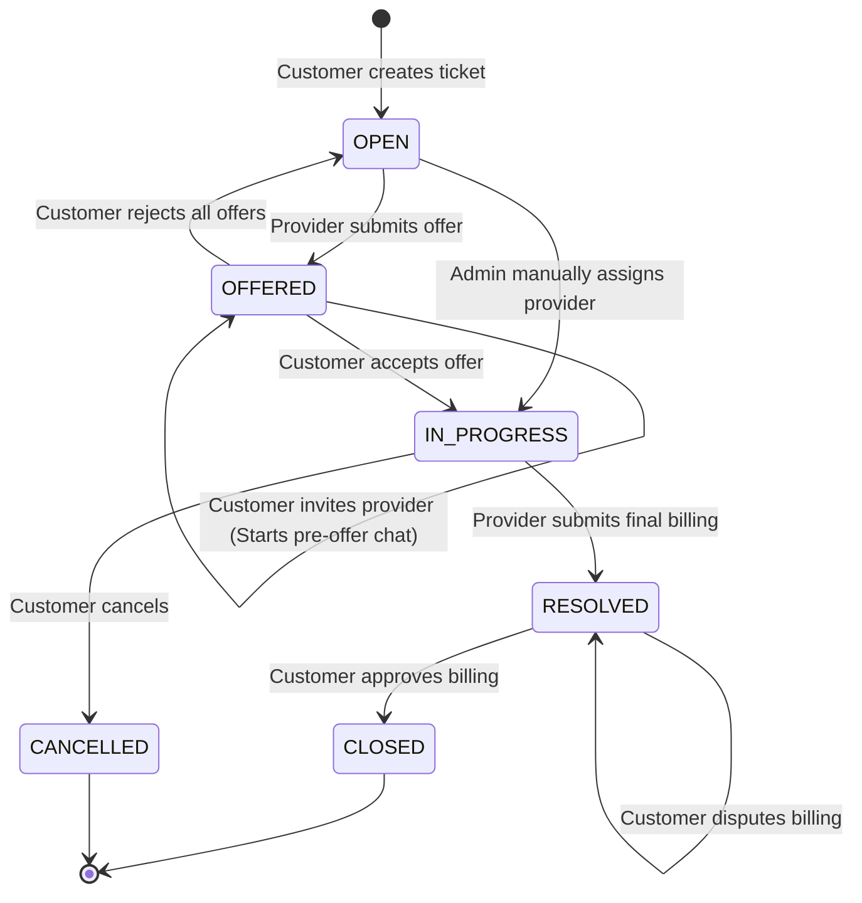

# Ztemizinden Core Workflows Guide

This document explains the core workflow operations in the Ztemizinden application, specifically focusing on the **Ticket Marketplace Lifecycle** and the **Service Provider Matching & Scoring Algorithm**.

---

## 1. Ticket Marketplace Lifecycle

The maintenance ticket acts as a state machine. It transitions through various stages from issue creation to final settlement and closure.

### Detailed Workflow States

#### 1. Creation (`OPEN`)
* **Trigger:** Customer calls `POST /api/tickets` specifying an asset ID, category, priority, and problem details.
* **System Action:** Checks if the asset belongs to the customer. Assigns an SLA target based on the priority (Critical = 45m, High = 120m, Medium = 240m, Low = 480m). Asset status remains `ACTIVE`.

#### 2. Offer Submission (`OFFERED`)
* **Trigger:** Service Provider calls `POST /api/tickets/{ticketId}/offers` to propose costs (`estimatedCost`), timing (`eta`), and notes (`message`).
* **System Action:** Ticket status changes to `OFFERED`. A new `TicketOffer` is saved in `PENDING` status. Only one active offer is allowed per provider per ticket.

#### 3. Pre-Offer Conversation & Negotiation (Optional)
* **Trigger:** Customer calls `POST /api/tickets/{ticketId}/offers/{offerId}/invite`.
* **System Action:** The offer status changes to `INVITED`. A `TicketConversation` is created in status `ACTIVE`.
* **Chat Logic:** Customer and provider exchange messages under this specific conversation ID. WS notifications are sent to the conversation topic `/topic/tickets/{ticketId}/conversations/{conversationId}/messages`.

#### 4. Selection Decisions (Accept / Reject)
* **Action A: Accept Offer**
  * **Trigger:** Customer calls `POST /api/tickets/{ticketId}/offers/{offerId}/accept`.
  * **System Action:**
    1. Sets the accepted offer's status to `ACCEPTED`.
    2. Rejects all other offers on the ticket (`REJECTED`).
    3. Closes all other active conversations on the ticket, setting status to `CLOSED` and closed reason to `NOT_SELECTED`.
    4. Sets the ticket's assigned provider, ETA, and estimated cost fields.
    5. Sets ticket status to `IN_PROGRESS`.
    6. Marks the target asset status as `UNDER_MAINTENANCE` in the inventory database.
* **Action B: Reject Offer**
  * **Trigger:** Customer calls `POST /api/tickets/{ticketId}/offers/{offerId}/reject`.
  * **System Action:** Sets offer status to `REJECTED` and closes its conversation (`CLOSED` / `REJECTED`). If no other selectable offers remain, the ticket status returns to `OPEN`.

#### 5. Job Execution (`IN_PROGRESS`)
* **Communication:** Negotiation chat closes. Customer and provider exchange messages directly at the ticket level. Notifications route to the ticket topic `/topic/tickets/{ticketId}/messages`.

#### 6. Completion & Billing (`RESOLVED`)
* **Trigger:** Provider calls `POST /api/tickets/{ticketId}/billing` with the `actualCost` and execution notes.
* **System Action:** Saves billing data. Ticket status transitions to `RESOLVED` and `billingStatus` changes to `AWAITING_CUSTOMER_APPROVAL`.

#### 7. Settlement (Approve / Dispute)
* **Action A: Approve**
  * **Trigger:** Customer calls `POST /api/tickets/{ticketId}/billing/approve`.
  * **System Action:** Sets `billingStatus` to `APPROVED`, ticket status to `CLOSED`. Returns the asset status to `ACTIVE`.
* **Action B: Dispute**
  * **Trigger:** Customer calls `POST /api/tickets/{ticketId}/billing/dispute` detailing reasons.
  * **System Action:** Sets `billingStatus` to `DISPUTED`. Ticket remains in `RESOLVED` status awaiting operations intervention.

#### 8. Cancellation (`CANCELLED`)
* **Trigger:** Customer calls `POST /api/tickets/{ticketId}/cancel` at any point before resolution.
* **System Action:** Sets status to `CANCELLED`. If the asset was under maintenance, it is returned to `ACTIVE`.

---

## 2. Service Provider Matching & Scoring Algorithm

When an admin uses the dispatch page, the system matches open tickets to verified service providers. The algorithm (`DispatchService.java`) scores and ranks providers out of **100 maximum points**.

### Matching Criteria & Scoring Formulas

#### 1. Mandatory Qualifications Filter
Before scoring, providers are filtered out unless they satisfy:
* `status` == `ProviderStatus.VERIFIED`
* `specialties` contains `ticket.category`

#### 2. Base Specialty Match (45 Points)
* Automatically adds **+45 points** to the score (since the qualification filter already guarantees a specialty category match).

#### 3. Geographic Proximity & Coverage Score (Max 35 Points)
Scores and estimates travel ETA minutes based on geographical coverage zones:
* **District Coverage Match:** If the customer's district is in the provider's `coverageDistricts` list:
  * Adds **+35 points**
  * Sets estimated travel time to **45 minutes**.
* **Base District Match:** If the provider's office district matches the customer's district:
  * Adds **+25 points**
  * Sets estimated travel time to **60 minutes**.
* **Base City Match:** If the provider's office city matches the customer's city:
  * Adds **+15 points**
  * Sets estimated travel time to **90 minutes**.
* **Out of Coverage Area:** If none of the above match:
  * Adds **+0 points**
  * Sets estimated travel time to **180 minutes**.

#### 4. Operational Trust Bonus (15 Points)
* If `provider.isTrusted()` is `true`:
  * Adds **+15 points**.

#### 5. Customer Satisfaction & Rating Weight (Max 10 Points)
* If aggregate `rating` is `4.5` or higher:
  * Adds **+10 points**.
* If aggregate `rating` is between `4.0` and `4.49`:
  * Adds **+6 points**.

#### 6. Service Volume Weight (5 Points)
* If `completedJobs` is greater than `100`:
  * Adds **+5 points**.

#### 7. Expertise Tag Similarity Matching (Max 24 Points)
This checks specific technical terms (e.g. `vana`, `pompa`, `inverter`) in the ticket details:
* **Context Compiler:** The system compiles a single text string by merging the following fields:
  * Ticket title & description
  * Asset name, brand, model, serial number, tag number, location, department, and description.
* **Turkish Text Normalization:** The compiled context and provider tags are processed to prevent spelling mismatch:
  1. Converts text to lowercase using the `tr-TR` Turkish locale.
  2. Normalizes Turkish characters: `ı -> i`, `ğ -> g`, `ü -> u`, `ş -> s`, `ö -> o`, `ç -> c`.
  3. Replaces all non-alphanumeric characters with spaces.
  4. Squashes multiple whitespaces.
* **Tag Matching:**
  * For every provider expertise tag found as a standalone word (padded with spaces) in the normalized context:
    * Adds **+8 points**.
  * Capped at **24 points** maximum (equivalent to 3 matching tags).

### Final Score Calculation
$$\text{Score} = \min(45 + \text{GeographicScore} + \text{TrustScore} + \text{RatingScore} + \text{VolumeScore} + \text{ExpertiseScore}, 100)$$

The dispatch API returns the list sorted by `Score` descending, then by `ETAMinutes` ascending.
