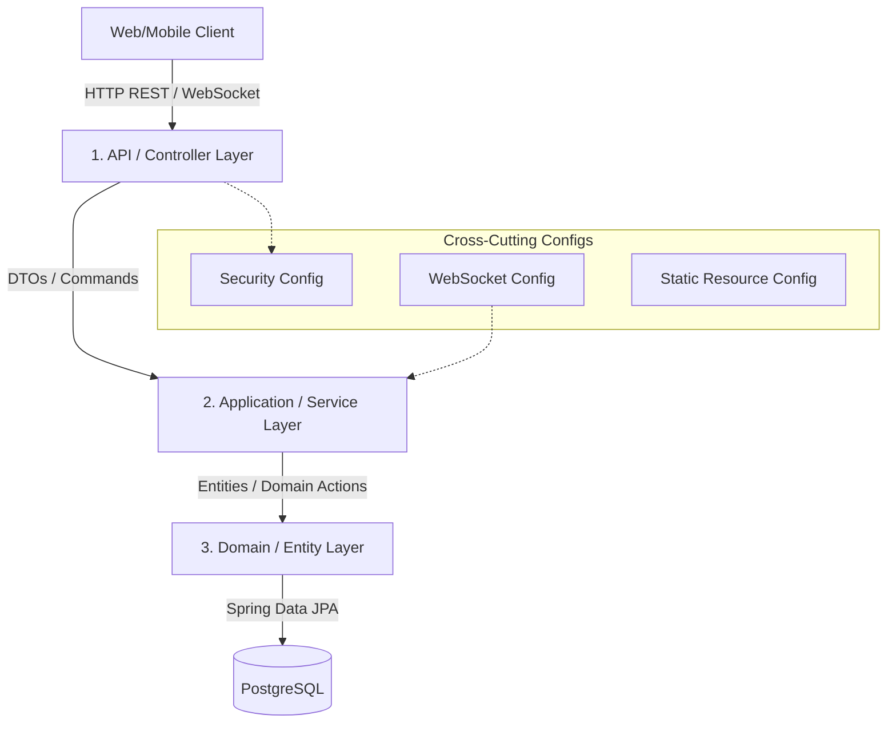

# Ztemizinden Backend System Architecture

This document describes the design layers, security model, real-time message broadcasting infrastructure, and static file storage layout of the Ztemizinden backend.

---

## 1. Directory Structure & Layered Design

The codebase strictly adheres to a standard layered architecture under `com.iknow.ztemizindenbackend`:



### Components
1. **API Layer (`com.iknow.ztemizindenbackend.api`):**
   * Exposes RESTful HTTP controllers (e.g., `TicketController`, `AssetController`).
   * Validates input payloads using standard `jakarta.validation` annotations.
   * Maps entities to response records (e.g., `TicketResponse`) using custom converters.
   * Handled global system exceptions via `@RestControllerAdvice` in `ApiExceptionHandler`.
2. **Application Layer (`com.iknow.ztemizindenbackend.application`):**
   * Orchestrates business actions through transactional Spring `@Service` beans (e.g., `TicketService`, `DispatchService`).
   * Manages domain entity loading, updating, and repository persistence.
   * Contains security checking classes like `CurrentUser` to extract user state from Spring Security Context.
   * Broadcasts real-time events via `TicketMessageBroadcaster`.
3. **Domain Layer (`com.iknow.ztemizindenbackend.domain`):**
   * Holds JPA `@Entity` annotations representing database tables (e.g., `Ticket`, `Asset`, `Customer`, `ServiceProvider`).
   * Enforces business rules and state changes inside domain model classes directly (e.g., `Asset.moveTo(...)`, `Ticket.acceptOffer(...)`).
   * Declares `@Repository` interfaces inheriting `JpaRepository` for DB access.
4. **Configuration Layer (`com.iknow.ztemizindenbackend.config`):**
   * Configures low-level components like security filters, static content serving, database connection setup, Jackson mapping, and STOMP WebSocket message brokers.

---

## 2. Authentication & Authorization Model

Ztemizinden uses **Keycloak as its only identity, password and token authority**. The custom browser login forms exchange credentials directly with Keycloak's token endpoint; the backend is a resource server and provisioning client.

### Route Security Configuration
Defined in `SecurityConfig.java`:
* Uses standard Spring OAuth2 Resource Server filters to validate incoming tokens.
* Can be globally bypassed by setting `APP_SECURITY_ENABLED=false` for local debugging.
* Routes are partitioned strictly by authority role limits:
  * **Public routes:** `POST /api/auth/forgot-password`, `POST /api/customers` (registration), `POST /api/providers` (registration), `/ws` handshake.
  * **Admin role (`ROLE_ADMIN`):** `/api/admin/**`, customer/provider admin management, verification of uploads.
  * **Customer role (`ROLE_CUSTOMER`):** `/api/assets/**`, `/api/tickets` CRUD, billing approval/disputes.
  * **Service role (`ROLE_SERVICE`):** `GET /api/providers/me`, provider profile changes, upload provider verification documents.
  * **Shared routes:** `/api/tickets/**` (shared access governed by resource-level checks).

### JWT & Role Parsing
Role mapping operates dynamically:
1. Custom `RealmRoleConverter` parses the JWT JSON payload.
2. It extracts roles listed under the `"realm_access"` claim:
   ```json
   {
     "realm_access": {
       "roles": ["CUSTOMER", "SERVICE", "ADMIN"]
     }
   }
   ```
3. Roles are normalized to uppercase, prefixed with `ROLE_`, and injected as `GrantedAuthority` records in the Spring Security context (e.g., `ROLE_CUSTOMER`).

### Authentication Source of Truth
Keycloak stores credentials, sessions and roles. `SecurityConfig` downloads signing keys from the configured JWK endpoint and requires the exact issuer plus the `ztemizinden-api` audience. `KeycloakIdentityService` uses a least-privilege service account to create users, assign realm roles, enable/disable provider identities and trigger password actions. Domain rows store only the immutable Keycloak `sub` in `identity_subject`; no password or refresh token is persisted by this application.

Frontend tokens remain inside the Keycloak JavaScript adapter's memory. API calls call `updateToken(30)` before sending the bearer token; logout clears the Keycloak-backed session. WebSocket CONNECT uses the current in-memory bearer token and the backend performs the same JWT validation.

---

## 3. Real-Time WebSockets (STOMP Broker)

For negotiation chat and real-time operational notifications, the system runs an in-memory STOMP broker.

### Broker Endpoints
Configured in `WebSocketConfig.java`:
* Handshake endpoint: `/ws` (with fallback to SockJS).
* Application prefix: `/app`.
* Broker topic subscription path prefix: `/topic`.

### Channel Access & Interceptor Security
Every websocket connection must be authenticated and authorized on a channel-by-channel level. This is enforced by `StompAuthChannelInterceptor` and validated in `TicketRealtimeAccess`:

1. **Connection Auth (`CONNECT` command):**
   * Evaluates native headers looking for `Authorization` or `authorization`.
   * Extracts the Bearer token, validates it against the `JwtDecoder`, and binds a `UsernamePasswordAuthenticationToken` to the WebSocket session principal.
2. **Subscription Access (`SUBSCRIBE` command):**
   * Subscriptions to topics are intercepted and checked programmatically.
   * **Client Publish Block:** Clients are blocked from publishing (`SEND` command) directly to any `/topic/...` brokers to prevent spoofing. Clients must send payload events to controller endpoints.

### Subscription Rule Matrix

| Topic Channel Format | Authorized Users | Authorization Criteria / Code Logic |
| --- | --- | --- |
| `/topic/customers/{customerId}/tickets` | `ADMIN`, matching `CUSTOMER` | Customer ID claim in JWT must match `{customerId}` in topic. |
| `/topic/providers/{providerId}/tickets` | `ADMIN`, matching `SERVICE` | Provider ID claim in JWT must match `{providerId}` in topic. |
| `/topic/tickets/{ticketId}/messages` | `ADMIN`, ticket-assigned `CUSTOMER`, ticket-assigned `SERVICE` | Allowed for the assigned customer. Allowed for provider *only if* they are assigned to the ticket, or have active offers on it, or the ticket is OPEN/OFFERED and category matches provider's specialty. |
| `/topic/tickets/{ticketId}/conversations/{conversationId}/messages` | `ADMIN`, ticket-assigned `CUSTOMER`, conversation-assigned `SERVICE` | Allowed for customer owning the ticket. Allowed for provider *only if* they own the negotiation conversation `{conversationId}`. |

---

## 4. Local File Storage Mechanism

Ztemizinden V1 stores media, logos, and verification documents directly on the backend server's file system, avoiding complex external cloud storage dependencies in early stage MVP.

### Storage Service (`UploadService.java`)
Manages safety rules and directory storage logic:
* **Upload limits & Content-Type validation:**
  * **Ticket Media:** Limited to `image/*` and `video/*` up to `50MB`.
  * **Profile Logos:** Limited to JPG, PNG, WEBP up to `5MB`. File extension verified strictly.
  * **Provider Documents:** Limited to PDF, JPG, PNG up to `10MB`. File extension verified strictly.
* **Storage location:**
  * Saves files under path prefix `uploads/{bucket}/`. File names are formatted securely using `UUID.randomUUID()` prefix to avoid file overwrite attacks and remove malicious characters.
* **Static Mount:**
  * `StaticResourceConfig` registers `/uploads/**` path to local folders.
  * **Document Privacy:** `SecurityConfig` blocks `/uploads/provider-documents/**` so only `ROLE_ADMIN` accounts can download them, while `/uploads/ticket-media/**` and `/uploads/profile-logos/**` remain publicly fetchable.
